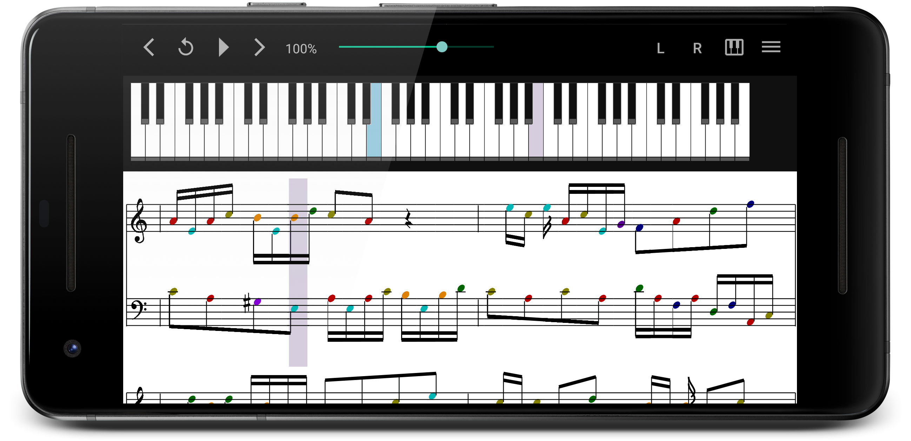
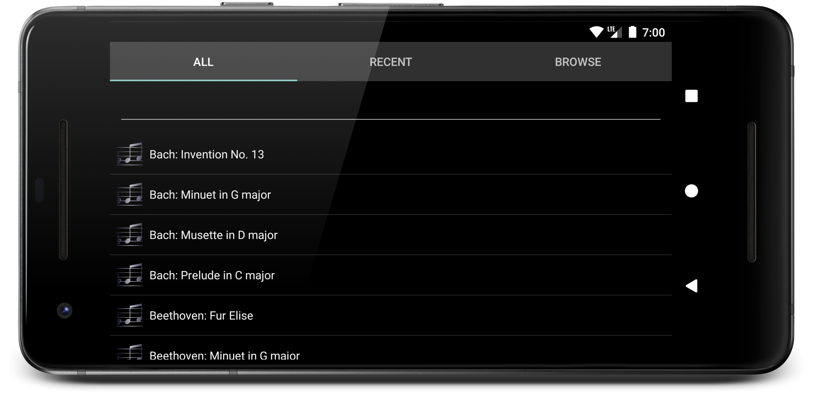
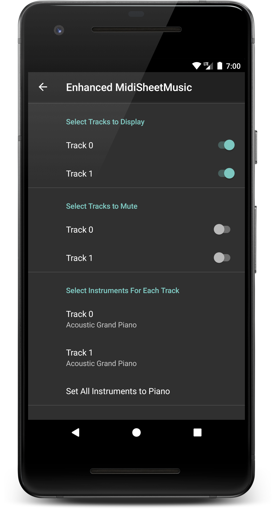
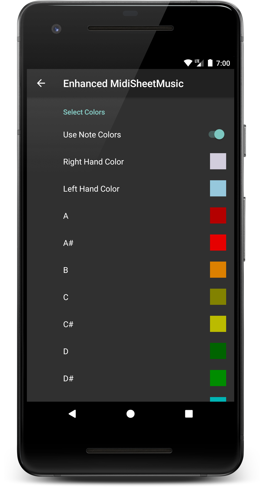

# MidiSheetMusic-android
An app for visualizing MIDI files with extra features to make learning new pieces easier.

 

 

This project has originally been created by Madhav Vaidy. However, it seems to have been abandoned since 2013. When I started using the app I got frustrated by some of the bugs. That's why I deceided to take over development.
The original project can be found [here](https://sourceforge.net/projects/midisheetmusic).

So far, the app has been updated to work with the latest version of Android, numerous bugs have been fixed and several features have been introduced. The app has been visually redesigned as well.

The next big feature in the works is adding external device support. That would allow a digital piano or keyboard to be connected to the phone/table and the app would give proper real-time feedback. I plan to publish the app to the Play Store after that. And, of course, it will still be free.

Please feel free to open a ticket for reporting a bug or requesting a feature.

## Contributions
- Thanks to [ankineri](https://github.com/ankineri) for implementing MIDI keyboard support.
